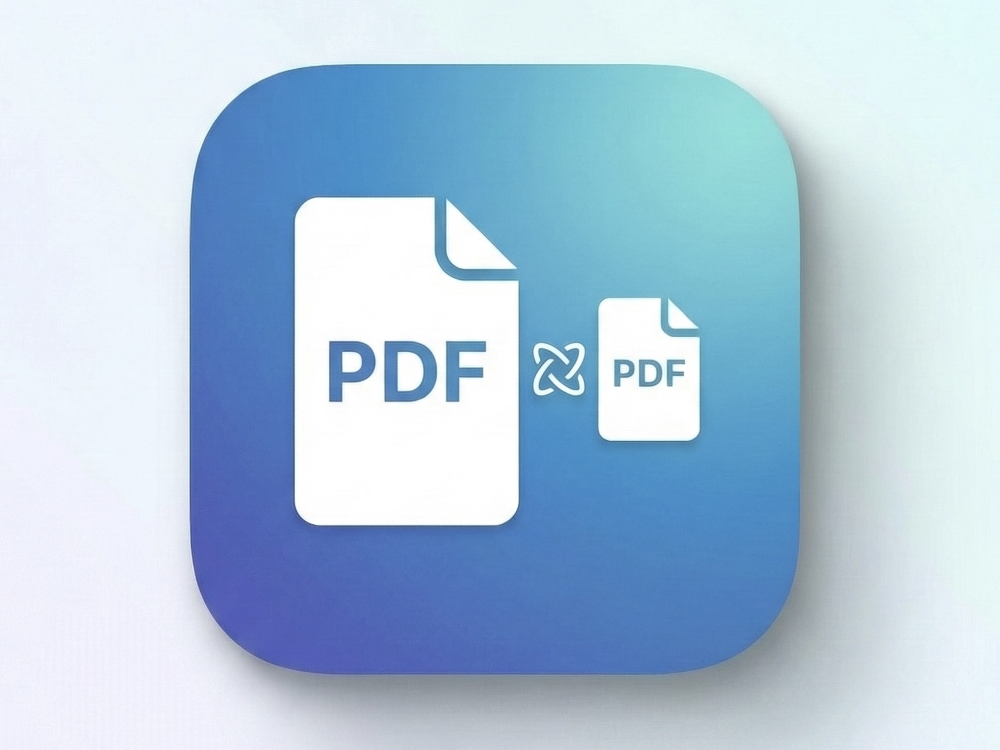

<p align="center">
  
</p>

<h1 align="center">PDF Optimizer</h1>

<p align="center">
  A lightweight, native-feeling macOS application for compressing PDF files using Ghostscript.
  <br>
  Drag, drop, optimize. That simple.
</p>

<p align="center">
  <a href="https://github.com/utkumtin/PDFOptimizerApp/releases/latest">
    
  </a>
</p>

---

## What It Does

PDF Optimizer reduces the file size of your PDFs by re-compressing images, downsampling resolution, and stripping unnecessary metadata — all powered by [Ghostscript](https://www.ghostscript.com/) under the hood.

**Choose your quality level:**

| Preset   | Typical Reduction | Best For                        |
|----------|-------------------|---------------------------------|
| Low      | ~70%              | Email attachments, web uploads  |
| Medium   | ~50%              | General use, ebooks             |
| High     | ~30%              | Printing                        |
| Maximum  | ~10%              | Prepress, archival              |

## Features

- **Drag & Drop** — Drop one or multiple PDFs directly onto the window
- **Batch Processing** — Optimize many files in one go, sequentially
- **Quality Presets** — Four levels from aggressive compression to near-lossless
- **Grayscale Conversion** — Optionally strip all color for even smaller files
- **Live Progress** — Smooth animated progress bar with per-file status
- **Size Comparison** — See exactly how much each file shrank (or grew)
- **Estimated Savings** — Preview expected compression before you start
- **Auto Dependency Setup** — Automatically installs Homebrew and Ghostscript if missing
- **Apple-like UI** — Card-based layout following Apple Human Interface Guidelines

## Installation

### Download (Recommended)

1. Go to [Releases](https://github.com/utkumtin/PDFOptimizerApp/releases/latest)
2. Download `PDFOptimizer.dmg`
3. Open the DMG and drag **PDF Optimizer** to your **Applications** folder
4. Launch from Applications

> **Note:** On first launch, macOS may warn about an unidentified developer. Go to **System Settings > Privacy & Security** and click **Open Anyway**.

### Build from Source

```bash
# Clone the repository
git clone https://github.com/utkumtin/PDFOptimizerApp.git
cd PDFOptimizerApp

# Install Python dependencies
pip install -r requirements.txt

# Run the application
python main.py
```

## Requirements

- **macOS** (tested on macOS 13+, Apple Silicon & Intel)
- **Ghostscript** — installed automatically via Homebrew on first launch, or install manually:
  ```bash
  brew install ghostscript
  ```

## How It Works

1. **Drop** your PDF files onto the app window (or use File > Open PDF)
2. **Select** a quality level using the segmented control
3. **Click Optimize** and watch the progress
4. Optimized files are saved alongside the originals with an `_optimized` suffix

The app uses Ghostscript's `QProcess`-based async pipeline:
- **Phase 1:** Counts pages for accurate progress tracking
- **Phase 2:** Runs the actual optimization with throttled progress signals
- Output is written to a temp file first, then atomically renamed on success

## Tech Stack

- **Python 3.11+**
- **PySide6** (Qt for Python) — UI framework
- **Ghostscript** — PDF compression engine
- **PyInstaller** — macOS app bundling

## Project Structure

```
PDFOptimizer/
├── main.py                 # Application entry point
├── core/
│   ├── engine.py           # Async Ghostscript processing engine
│   ├── gs_detector.py      # Finds Ghostscript binary on macOS
│   ├── file_utils.py       # PDF validation, size formatting, estimates
│   └── dependency_manager.py  # Homebrew/GS auto-installer
├── ui/
│   ├── main_window.py      # Main window with drag & drop zone
│   ├── components.py       # Cards, buttons, progress bar, file list
│   └── setup_dialog.py     # First-run dependency setup dialog
└── resources/
    ├── style.qss           # Apple HIG stylesheet
    ├── icon.icns           # macOS application icon
    └── trash.svg           # Delete icon
```

## License

This project is open source and available under the [MIT License](LICENSE).
